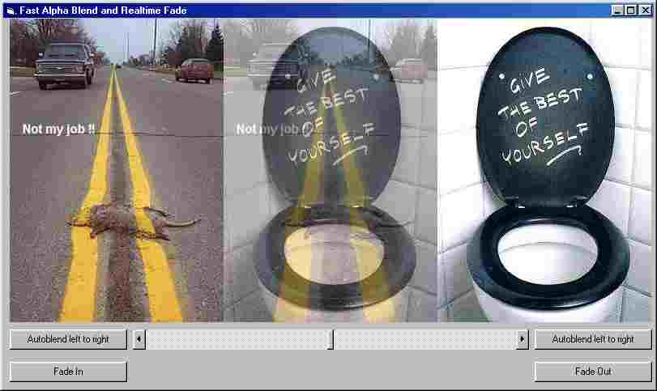

<div align="center">

## Fast Alpha Blend and Realtime Fade


</div>

### Description

Its a simple and real fast Alphablend routine in pure VB. Now its faster and i added realtime Fade.
 
### More Info
 


<span>             |<span>
---                |---
**Submitted On**   |2002-09-12 15:48:06
**By**             |[Scythe](https://github.com/Planet-Source-Code/PSCIndex/blob/master/ByAuthor/scythe.md)
**Level**          |Intermediate
**User Rating**    |5.0 (15 globes from 3 users)
**Compatibility**  |VB 5\.0, VB 6\.0
**Category**       |[Graphics](https://github.com/Planet-Source-Code/PSCIndex/blob/master/ByCategory/graphics__1-46.md)
**World**          |[Visual Basic](https://github.com/Planet-Source-Code/PSCIndex/blob/master/ByWorld/visual-basic.md)
**Archive File**   |[Fast\_Alpha1303119122002\.zip](https://github.com/Planet-Source-Code/scythe-fast-alpha-blend-and-realtime-fade__1-38883/archive/master.zip)

### API Declarations

```
Private Declare Function GetDIBits Lib "gdi32" (ByVal aHDC As Long, ByVal hBitmap As Long, ByVal nStartScan As Long, ByVal nNumScans As Long, lpBits As Any, lpBI As BITMAPINFO, ByVal wUsage As Long) As Long
Private Declare Function SetDIBits Lib "gdi32" (ByVal hdc As Long, ByVal hBitmap As Long, ByVal nStartScan As Long, ByVal nNumScans As Long, lpBits As Any, lpBI As BITMAPINFO, ByVal wUsage As Long) As Long
```


